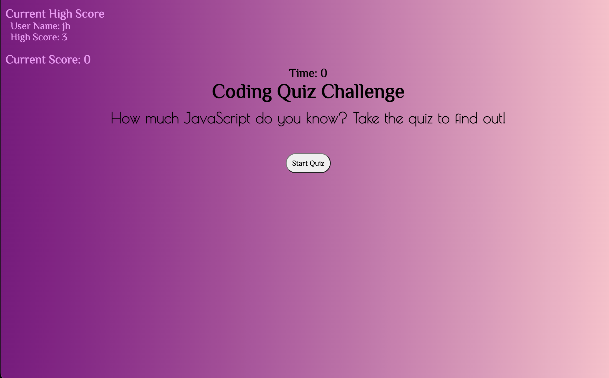

# api-code-quiz

A JavaScript Quiz

## Description

This website is a quiz for website developers. Its purpose is to refresh their JavaScript knowledge. This JavaScript quiz provides the user with five questions to be answered in 20 seconds. Users can save their score with their initials and will be saved in the local storage.

## Installation

N/A

## Usage

To get started click on the "Start Quiz" button. From here the timer will begin at 20 seconds and appear above the question. Question 1 will appear with four button choices. If the correct answer is chosen "Correct!" will appear below button choices and additional time will be given to complete the quiz. If the wrong answer is chosen "Wrong" will appear below and time will be deducted. If time is 0 the user will be directed to a screen that will say "Your Final Score is: " and final score will be displayed along with and Initials input box. After initials are typed and submit button is clicked, this will be saved under Current High Score. If user want to retake the quiz they can simply click the "Start Again" button and the welcome page with "Coding Quiz Challenge" header will open and the user can click "Start Quiz" to start the quiz again.
Here is the link for full access https://judy-her.github.io/api-code-quiz/

## Credits

I had help from UCB Xpert Learning Assistant AI. It helped me create a findIndex function to find existing user and check if it was currently the high score.
ChatGpt helped create a flag in order to only add 3 points and no more if the user's answer was correct.

## License

Please refer to LICENSE in the repo.
